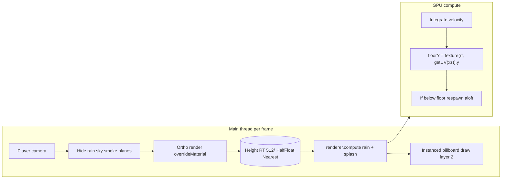

# Collision rain — height texture + GPU compute

How Threejs-Punk renders thousands of rain streaks and ground splashes that **respect rooftops, props, and terrain** without CPU raycasts.

**Audience:** graphics programmers and coding agents porting this pattern.

**Source of truth:** [`createCollisionHeight.js`](../../src/world/weather/createCollisionHeight.js), [`createCollisionRain.js`](../../src/world/weather/createCollisionRain.js), [`collisionHideObjects.js`](../../src/world/weather/collisionHideObjects.js).

---

## Problem and approach

| Naive approach | Cost |
|----------------|------|
| Raycast each drop vs city mesh every frame | CPU-bound, does not scale to ~5000 instances |
| Ignore collision | Rain falls through buildings |

**Approach:** Treat collision as a **2D height field** in world XZ:

1. Once per frame (or every N frames), render a **top-down orthographic pass** into a texture. Each texel stores the **world Y** of the highest surface in that column.
2. On the GPU, **compute shaders** move drops and splashes; each step **samples** the height texture at the particle’s XZ.

This is the “hit area using a texture” pattern: the RT is not a painted mask from art — it is **generated from live geometry**.

---

## System diagram



---

## Part 1 — Collision height pass

**File:** `createCollisionHeight.js`  
**Class:** `CollisionHeight`  
**Factory:** `createCollisionHeight({ scene, renderer, width, height, depth, resolution, cameraHeight })`

### Render target

- Size: `performanceProfile.collisionRainResolution` (default **512**).
- Format: **HalfFloat**, **nearest** min/mag filter, **no mipmaps** — avoids blending heights between texels at edges.

### Ortho volume

- Footprint: default **100 × 100** world units (`width`, `height`).
- Depth range: `depth` default **80** (near/far of ortho camera).
- Camera sits at **`cameraHeight`** (default **50**), looks at `(center.x, 0, center.z)`.
- **Center follows the player camera** XZ each update — only nearby geometry contributes.

### Override material

Every mesh in the scene (except temporarily hidden objects) renders with:

```javascript
this.material.outputNode = vec4(positionWorld, 1);
```

Rain simulation reads **`.y`** from the sampled texel as `floorHeight`. The full `positionWorld` is available if you extend the system (e.g. surface normals from MRT later).

### UV mapping (must stay consistent)

`getUV(worldPos)` — world XZ → `[0,1]²` relative to volume center.  
`getPosition(uvNode)` — inverse for debugging.

Compute shaders **must** use the same `getUV` as the pass that wrote the RT.

### Frame skip

`collisionRainFrameSkip` (default **1**): `update()` returns early on skipped frames. Compute still runs but reads a **slightly stale** height map — cheap tradeoff.

### Texel-snapped caching

The volume center snaps to the texel grid (`width / resolution`), and `update()` only re-renders when the snapped cell changes — plus a safety refresh every `refreshIntervalFrames` (default 60) for late-loaded content. An idle or slowly drifting camera costs no height pass at all; snapping also stops floor heights swimming as the camera moves. Call `invalidate()` after moving static geometry. The render loop passes `getHideObjects` so the hide list is only built on frames that actually render.

### Render loop integration

[`createRenderLoop.js`](../../src/runtime/createRenderLoop.js) calls **before** `world.rain.update`:

```javascript
world.collisionHeight?.update({
  camera,
  hideObjects: collectCollisionHideObjects(world),
});
```

Order matters: height RT must be current (or intentionally stale) before compute.

---

## Part 2 — Hide list (critical)

**File:** `collisionHideObjects.js`  
**Function:** `collectCollisionHideObjects({ rain, smoke, planes, sky })`

During the height pass, these are set `visible = false`:

| Object | Why |
|--------|-----|
| `rain.group` | Streaks would become “ground” |
| `sky.mesh` | Dome would cap the height map |
| `planes.group` | Flying geometry false floor |
| Each smoke `emitter.mesh` | Particles false floor |

If you add new **large transparent layers** (fullscreen quads, particle systems), add them here or exclude them via layers.

**Note:** Rain renders on **layer 2** (`RAIN_LAYER`) for the beauty pass; the height pass uses the default scene render with override material — rain is hidden by **visibility**, not layer mask.

---

## Part 3 — GPU rain and splashes

**File:** `createCollisionRain.js`  
**Entry:** `createCollisionRain({ scene, renderer, collisionHeight, camera, count, rainArea })`

### Buffers

- `instancedArray(activeCount, "vec3")` — positions, velocities.
- Splash: position buffer + `uint` cycle index.
- Default count: **5000** (`collisionRainCount`), clamped **[500, 5000]**.

### Camera-centered toroidal volume

Rain simulates in a box **in front of the camera**:

- `centerPos = cameraPos + cameraDir * cameraForwardOffset` (default offset **15**).
- Rain area default **60×60** (can differ from height map **100×100** — height map is slightly larger footprint).
- XZ **wrap** with `fract` so drops recycle without reallocating when the camera moves.

### Compute: particle update

Pseudocode matching the TSL graph:

```
position += velocity
wrap XZ around centerPos in rainArea
coords = collisionHeight.getUV(position)
floorHeight = texture(heightRT, coords).y
if position.y < floorHeight + 0.05:
  respawn y in [20, 35] with hash
  respawn xz in rainArea around centerPos
  re-roll velocity.y
```

Uses TSL **`If(...)`** inside `Fn(() => ...).compute(activeCount)`.

### Compute: splashes

- Horizontal **5-frame** atlas: `/textures/water-splash.webp`.
- Phase per instance: `floor(time * splashSpeed + hash)`.
- On new cycle: pick random XZ, set `splashPos.y = floorY + 0.06` from same height texture.
- **Opacity uses `.r`** — asset has no real alpha (documented in source).

### Draw

- One **instanced** `PlaneGeometry` for streaks, one for splashes.
- **`billboarding()`** with buffer attributes from compute.
- `depthWrite: false`, `transparent: true`, `toneMapped: false`.
- **`frustumCulled = false`** + huge bounding sphere — instances live in world space; incorrect culling is worse than always drawing.

### Render layer and post

- `RAIN_LAYER = 2`; main camera enables this layer.
- Returns **`useDedicatedPass: false`** — rain composites in the main beauty pass (post has optional dedicated rain pass; this project does not use it for collision rain).
- GTAO pre-pass disables rain layer so streaks do not corrupt AO.

---

## Part 4 — Wiring in the world

[`createWorld.js`](../../src/world/createWorld.js) when `FEATURES.rain`:

1. `collisionHeight = createCollisionHeight({ scene, renderer })`
2. `rain = await createCollisionRain({ scene, renderer, collisionHeight, camera })`

World export exposes `collisionHeight` and `rain` for the render loop and inspector.

Warmup also calls `collisionHeight.update` with the same hide list ([`warmup.js`](../../src/runtime/warmup.js)).

---

## Performance knobs

From [`performanceProfile.js`](../../src/platform/performanceProfile.js):

| Key | Default | Effect |
|-----|---------|--------|
| `collisionRainResolution` | 512 | Height RT size |
| `collisionRainFrameSkip` | 1 | Skip height renders |
| `collisionRainCount` | 5000 | Compute + instance count |

Tuning guide:

- **GPU bound:** lower count, increase frame skip, lower resolution (384).
- **Rain through roofs:** check hide list; verify nearest filtering; ensure height pass runs before compute.
- **Popping at volume edge:** increase `width/height` of height volume or rain area together.

---

## Replication checklist (minimal port)

Use this as an agent task list:

- [ ] Create ortho top-down camera + RT (half-float, nearest).
- [ ] Override material outputting world position (or at least Y via MRT).
- [ ] Center volume on camera XZ each frame.
- [ ] Hide non-geometry contributors from that pass.
- [ ] Implement `getUV(worldXZ)` shared between pass and compute.
- [ ] Compute: integrate, sample Y, respawn with GPU branch.
- [ ] Instanced billboard draw; optional splashes with same height sample.
- [ ] Integrate update order: **height → compute → scene render**.
- [ ] Expose resolution / count / frame skip as config.

---

## History in this repo

Commit **`89e766f`** (“rain update”) replaced the older streak-only implementation with `createCollisionHeight` + `createCollisionRain` (~650 lines added, `createRainStreaks.js` removed). That change is the reference architecture documented here.

---

## Related docs

- [README — Collision rain](../../README.md#collision-rain--the-height-hit-texture)
- [AGENTS.md — Recipe A](../../AGENTS.md#a-gpu-rain-that-respects-geometry-height-hit-texture)
- [AGENTS.md — Hard constraints](../../AGENTS.md#hard-constraints)
